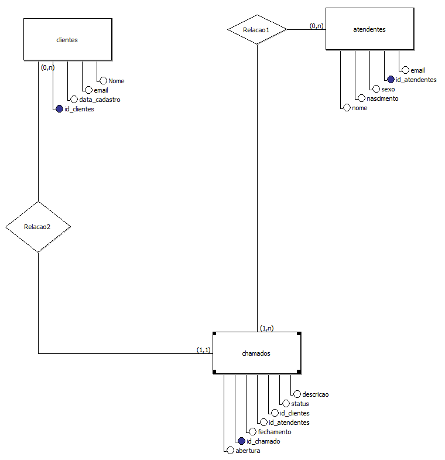

# Sistema de Atendimento - Modelagem em SQL

Projeto prático de modelagem de banco de dados relacional simulando um sistema de atendimento ao cliente.

O objetivo deste projeto é aplicar conceitos fundamentais de SQL e modelagem de dados, incluindo:

- Criação de tabelas
- Chaves primárias (Primary Key)
- Chaves estrangeiras (Foreign Key)
- Cardinalidade
- Integridade referencial

---

## Estrutura do Banco de Dados

O sistema é composto por três entidades principais:

### 📁 CLIENTES

- ID_CLIENTE (Primary Key)
- NOME (obrigatório)
- DATA_CADASTRO
- EMAIL (obrigatório)

**Regras de negócio:**
- Um cliente pode existir sem possuir chamados.
- Um cliente pode ter vários chamados.
- O e-mail é obrigatório, mas pode se repetir.

---

### 📁 ATENDENTES

- ID_ATENDENTE (Primary Key)
- NOME (obrigatório)
- EMAIL (obrigatório e único)
- NASCIMENTO (obrigatório)
- SEXO (ENUM: 'F', 'M')

**Regras de negócio:**
- Um atendente pode existir sem possuir chamados.
- Um atendente pode estar vinculado a vários chamados.
- O e-mail deve ser único no sistema.

---

### 📁 CHAMADOS

- ID_CHAMADO (Primary Key)
- STATUS (ENUM: 'ABERTO', 'EM ESPERA', 'FECHADO')
- ABERTURA (obrigatório)
- FECHAMENTO
- ID_CLIENTE (Foreign Key)
- ID_ATENDENTE (Foreign Key)

**Regras de negócio:**
- Todo chamado deve estar vinculado a um cliente.
- Todo chamado nasce com um atendente atribuído.
- Um cliente pode ter vários chamados.
- Um atendente pode ter vários chamados.

- ---

## Cardinalidade

O modelo relacional foi definido com base nas seguintes relações:

- CLIENTES (0,N) → CHAMADOS (1,1)
- ATENDENTES (0,N) → CHAMADOS (1,1)

### Interpretação:

- Um cliente pode ter zero ou vários chamados.
- Todo chamado deve estar vinculado a exatamente um cliente.

- Um atendente pode ter zero ou vários chamados.
- Todo chamado deve possuir exatamente um atendente responsável.

As chaves estrangeiras foram definidas na tabela **CHAMADOS**, pois ela representa o lado N da relação 1:N, sendo a entidade dependente das demais.

---

## Objetivo do Projeto

Este projeto tem como finalidade consolidar conhecimentos em modelagem relacional, aplicação de cardinalidade e definição de regras de negócio utilizando SQL.

A proposta é evoluir o projeto gradualmente, incluindo inserção de dados, consultas com JOIN e possíveis melhorias na estrutura do banco de dados.

---

## Como Executar o Projeto

1. Criar o banco de dados no SGBD de sua preferência.
2. Executar os scripts das tabelas na seguinte ordem:
   - CLIENTES
   - ATENDENTES
   - CHAMADOS
3. Verificar a criação das tabelas e suas restrições.

O projeto foi desenvolvido utilizando conceitos compatíveis com MySQL.

---

## Diagrama do Modelo ER

Abaixo está a representação visual das entidades e seus relacionamentos:

---

## Inserção de Dados (DML)

Após a criação das tabelas, foi desenvolvido um script [`inserts.sql`](./inserts.sql) para popular o banco com dados iniciais de teste.

O script inclui:

- Inserção múltipla de registros utilizando `INSERT INTO`
- Respeito às restrições de `FOREIGN KEY`
- Utilização de `NULL` para campos opcionais
- Distribuição coerente de chamados entre clientes e atendentes

Esse processo permitiu validar:

- Integridade referencial
- Funcionamento das chaves estrangeiras
- Regras de obrigatoriedade (NOT NULL)
- Consistência entre status e data de fechamento

---

## Atualização de Dados (UPDATE)

As alterações realizadas nos registros estão documentadas no arquivo [`updates.sql`](./updates.sql).

O script contempla o processo completo de atualização, incluindo:

- Consulta prévia com `SELECT` para validação do registro
- Utilização de `UPDATE` com cláusula `WHERE`
- Correção controlada de campos específicos
- Consolidação de múltiplas alterações em uma única instrução quando aplicável

A inclusão das consultas de validação simula uma prática comum em ambiente de produção, onde é essencial confirmar os dados antes de aplicar modificações, reduzindo riscos de alterações indevidas.

---

## Exclusão de Dados (DELETE)

O procedimento de exclusão está documentado no arquivo [`deletes.sql`](./deletes.sql).

O script demonstra uma exclusão controlada e segura, contendo:

- Identificação prévia do registro via `SELECT`
- Verificação específica por chave primária
- Execução de `DELETE` com cláusula `WHERE`
- Respeito às regras de integridade referencial definidas no banco

Assim como no processo de atualização, as consultas de validação foram mantidas no script para evidenciar a adoção de boas práticas antes da remoção de dados.
---

## Consultas Básicas (SELECT)

As consultas iniciais estão documentadas no arquivo [`queries_nivel1.sql`](./queries_nivel1.sql).

Esta etapa contempla operações fundamentais da linguagem SQL, incluindo:

- Listagem completa dos registros da tabela `chamados`
- Aplicação de filtro utilizando cláusula `WHERE`
- Ordenação de resultados com `ORDER BY`
- Limitação de registros utilizando `LIMIT`
- Aplicação de boas práticas ao combinar `ORDER BY` com `LIMIT`

As consultas foram executadas com o objetivo de validar a integridade dos dados inseridos e consolidar os fundamentos necessários para análises mais avançadas.

Abaixo estão os resultados obtidos a partir da execução das queries:

### 🔎 Listagem Completa de Chamados (Exibição parcial dos registros para validação da estrutura e integridade dos dados.)

---

### 🔎 Filtro por Status (ABERTO)

---

### 🔎 Ordenação por Data de Abertura (Mais Recente → Mais Antigo) (Exibição parcial dos registros)

---

### 🔎 Limitação de Resultados (Top 5 por ID)

---

As evidências apresentadas demonstram o correto funcionamento das instruções de consulta, garantindo base consistente para aplicação de filtros compostos, agregações e junções entre tabelas nas próximas etapas do projeto.

---
